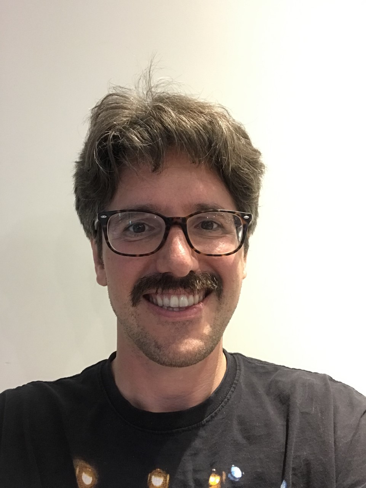

## About Me

Programmer, Teacher, Archaeologist, Scientist. I like to make the Past meet the Future by researching and tinkering with anything technological. From old-school computers, to motorcycles, to Raspberry Pi's.

## Education

`2020`
**IT-Traineeship Java Full Stack Development**, *Qien B.V.*

`2009-2012`
**PhD Classical and Mediterranean Archaeology**, *Leuven University*

`2000-2007`
**BA-MA Classical and Mediterranean Archaeology**, *Leiden University*

## Certification

`2020`
Scrum PSM-1

`2020`
Oracle Certified Associate

## Occupation

`2021 - Now`
Junior Teacher Programming and Information Technology at CodeCafé
- Teaching Python at the University of Applied Sciences in Utrecht
- Creating online tutorials in Java, HTML, JavaScript
- Filming Youtube tutorials on e.g. Raspberry Pi's (NAS or Home Automation), OpenLayers, Leaflet, Mapbox, Swing, Chart.JS and other libraries

`2021 June - Now`
Post-Doctoral Researcher Roman Archaeology, Radboud University, Nijmegen
- Designing and setting up research / collecting data
- Geographical Information Systems
- Developing a Web-GIS application to share research data and results
- Guiding PhD's / Mentoring

`2021 - June`
Teacher Ancient History, Utrecht University
- Designing and teaching interactive online seminars
- Grading, mentoring and motivating students

 

`2020`
**Full Stack Developer Trainee**, *Qien*, Utrecht
- *Frontend development with JavaScript and React*
- *Backend development with Java*
- *OCA certification training*
- *Scrum training*
- *DevOps with Jenkins and Github Actions*

`2020`
**Senior Fellow**, *ANAMED, Center for Anatolian Civilizations*, Istanbul
- *Collecting data-sets (on Roman Villages) and designing and executing statistical analyses*

`2017-2019`
**Archaeological Field Leader and Research Coordinator**, *KU Leuven, Researchgroup*, Leuven
- *Spatial Analyses in ArcGIS / QGIS using Python queries*

`2013-2017`
**Post-doctoral researcher**, *Leiden University, Institute for History*, Leiden
- *Researching spatial and chronological distribution patterns of archaeological Big Data sets*
- *Designing databases in Access en SQL*
- *Data-Analyse spatial patterns with Excel, R, QGIS*
- *3D modelling*
- *Teaching classes and designing courses / writing syllabi*

## Skills
<table>
 <tr>
  <td><h3>Technical</h3></td>
  <td><h3>Soft</h3></td>
 </tr>
 <tr>
    <td>Java</td>
    <td>Scrum</td>
 </tr>
  <tr>
    <td>Spring</td>
    <td>Coaching students</td>
 </tr>
  <tr>
    <td>Hibernate</td>
    <td>Mentoring</td>
 </tr>
  <tr>
    <td>Maven</td>
    <td>Lesson/Course Planning</td>
 </tr>
  <tr>
    <td>Swing</td>
    <td>Communicative</td>
 </tr>
   <tr>
    <td>JavaFX</td>
    <td>Self-Improving</td>
 </tr>
 <tr>
    <td>HTML5</td>
    <td>Curious mind</td>
 </tr>
 <tr>
    <td>CSS</td>
    <td></td>
 </tr> 
 <tr>
    <td>JavaScript</td>
    <td></td>
 </tr>
 <tr>
    <td>SQL</td>
    <td></td>
 </tr>
 <tr>
    <td>Statistical Software (Access, R)</td>
    <td></td>
 </tr>
 <tr>
    <td>Linux</td>
    <td></td>
 </tr>
 <tr>
    <td>Python</td>
    <td></td>
 </tr>
 <tr>
    <td>Git</td>
    <td></td>
 </tr>
 <tr>
    <td>various front-end libraries (React, Chart.JS, OpenLayer, Leaflet, MapBox, BootStrap)</td>
    <td></td>
 </tr>
  <tr>
    <td>various back-end libraries (Spring, Tomcat, GeoServer)</td>
    <td></td>
 </tr>
   <tr>
    <td>GIS Software (QGIS, Grass, ArcGis)</td>
    <td></td>
 </tr>
</table>

## Publications (selection)

`2014`
Willet, R. Experiments with Diachronic Data Distribution Methods Applied to Eastern Sigillata A in the Eastern Mediterranean." HEROM. Journal on Hellenistic and Roman Material Culture 3: 39-69.

`2016`
Ottoni, C., Rasteiro, R., Willet, R. et al. "Comparing maternal genetic variation across two millenia reveals the demographic history of an ancient human population in southwest Turkey." Royal Society Open Science 3.

`2020`
Willet, R., The Geography of Roman Asia Minor, Equinox, Sheffield

`2020`
Willet, R., The Economics of Urbanism in the Roman East, Propylaeum, Heidelberg
https://books.ub.uni-heidelberg.de/propylaeum/catalog/book/571?lang=en

## Awards

`2007`

MA/Drs. "met veel genoegen" / cum laude, Leiden University

`2020`

Grant Senior Fellowship, ANAMED - Koc University, Istanbul

## References

* Jeroen Poblome: Faculty of Arts, KU Leuven
* John Bintliff, Edinburgh University
